# 📦 **Delivery App**

## 🧩 Visión General

**Delivery App** es una aplicación híbrida creada con **Ionic + Angular** para el frontend y **ASP.NET Core + MySQL** para el backend. Está diseñada para permitir a los usuarios explorar comidas por categoría, autenticarse con Google, y realizar pedidos de manera rápida y sencilla.

---

## 🖥️ **Frontend (Ionic + Angular)**

### 🔑 Funcionalidades actuales

| Funcionalidad                    | Estado            | Descripción                                             |
| -------------------------------- | ----------------- | ------------------------------------------------------- |
| Autenticación (Google OAuth 2.0) | ✅ Solo Backend    | Login vía Google con JWT personalizado.                 |
| Autenticación (JWT)              | ✅ Implementada    | Login vía con JWT personalizado.                        |
| Búsqueda de Comida               | ✅ Implementada    | Filtrar comida por ingredientes o nombres o categoría.    |
| Usuario                          | ✅ Implementada    | Manejo datos del usuario.                                |
| Explorar comidas                 | ✅ Implementada    | Filtrado por categoría.                                 |
| Carrito de compras               | ✅ Implementada    | Agregar y eliminar productos.                           |
| Checkout                         | ⚠️ Solo frontend  | Interfaz completada, falta integración con backend.     |
| Dirección de entrega             | ⚠️ Solo frontend  | Formulario funcional, sin almacenamiento persistente.   |
| Historial de pedidos             | ⚠️ Solo frontend  | Datos mockeados visibles, sin conexión a base de datos. |
| Método de pago                   | ❌ No implementado | UI pendiente y sin lógica funcional.                    |

---

## 🧠 **Backend (ASP.NET Core + EF Core + MySQL)**

### 🛠️ Paquetes principales

* `EntityFrameworkCore` + `Pomelo.EntityFrameworkCore.MySql`
* `Microsoft.AspNetCore.Authentication.JwtBearer`
* `Google.Apis.Auth`

### 🔐 Seguridad

* Validación de `id_token` de Google.
* Generación y validación de JWT personalizados.
* Autenticación protegida con `Bearer Token`.

### 📊 Estructura de datos y relaciones

| Modelo                   | Relación         |
| ------------------------ | ---------------- |
| `Category` → `Food`      | Uno a muchos     |
| `Food` ↔ `Ingredient`    | Muchos a muchos  |
| `User` → `Order`         | Uno a muchos     |
| `Order` → `OrderHistory` | Uno a muchos     |
| `FoodIngredient`         | Tabla intermedia |

---

## 🚀 **Mejoras Futuras**

### 🛍️ Checkout (Frontend completo, falta backend)

* Enviar contenido del carrito al backend.
* Calcular totales, impuestos, y asignar dirección y método de pago.

### 🏡 Dirección de Entrega (Frontend listo, sin backend)

* Separar entidad `Address` en su propia tabla.
* Relacionar múltiples direcciones por usuario.
* Selección de dirección predeterminada.

📌 **Modelo sugerido para `Address`**

```json
{
  "id": 1,
  "name": "Casa de Juan",
  "address": "Calle 123",
  "city": "Madrid",
  "house": "N° 456",
  "isDefault": true
}
```

### 📦 Historial de Pedidos (Mock en frontend, sin lógica backend)

📌 **Ejemplo de Orden:**

```json
{
  "id": "ORD-001",
  "date": "2023-06-15T19:30:00",
  "total": 24.98,
  "status": "delivered",
  "items": [
    { "name": "Hamburguesa Clásica", "quantity": 1, "price": 8.99 },
    { "name": "Pizza Margherita", "quantity": 1, "price": 12.99 },
    { "name": "Refresco", "quantity": 1, "price": 2.99 }
  ]
}
```

### 💳 Método de Pago (No implementado)

📌 **Datos requeridos del formulario:**

| Campo           | Requerido | Descripción                              |
| --------------- | --------- | ---------------------------------------- |
| `fullName`      | ✅         | Nombre completo del comprador            |
| `phone`         | ✅         | Teléfono de contacto                     |
| `city`          | ✅         | Ciudad de entrega                        |
| `address`       | ✅         | Dirección de calle                       |
| `zipCode`       | ✅         | Número o referencia de casa              |
| `paymentMethod` | ✅         | Opción elegida (efectivo, tarjeta, etc.) |

🔒 **Si se elige tarjeta:**

| Campo        | Requerido | Validación               |
| ------------ | --------- | ------------------------ |
| `cardNumber` | ✅         | Número válido de tarjeta |
| `cardExpiry` | ✅         | Mes/Año de expiración    |
| `cardCvv`    | ✅         | Código CVV de 3 dígitos  |

📋 **Resumen del pedido**

```json
{
  "subtotal": 18.97,
  "deliveryFee": 5.00,
  "total": 23.97
}
```

---

## 📚 Tablas sugeridas para próximas migraciones

### 📌 Tabla: `Address`

| Campo       | Tipo     | Descripción                            |
| ----------- | -------- | -------------------------------------- |
| `id`        | `int`    | Clave primaria                         |
| `name`      | `string` | Nombre referencial ("Casa", "Oficina") |
| `address`   | `string` | Dirección exacta                       |
| `city`      | `string` | Ciudad                                 |
| `house`     | `string` | Número de casa o piso                  |
| `isDefault` | `bool`   | Es la dirección predeterminada         |

---

### 📌 Tabla: `OrderHistory`

| Campo    | Tipo       | Descripción                                      |
| -------- | ---------- | ------------------------------------------------ |
| `id`     | `string`   | ID de pedido (ej: "ORD-001")                     |
| `userId` | `string`   | Usuario que hizo el pedido                       |
| `date`   | `datetime` | Fecha del pedido                                 |
| `total`  | `decimal`  | Monto total                                      |
| `status` | `string`   | Estado del pedido (`delivered`, `pending`, etc.) |
| `items`  | `json`     | Lista de productos (nombre, cantidad, precio)    |

---

## 📌 Notas finales

* El frontend está avanzado, pero el backend aún necesita endpoints RESTful para:

  * Guardar direcciones.
  * Finalizar pedidos.
  * Historial de órdenes.
  * Métodos de pago.


---
# Preview

## Dark Mode

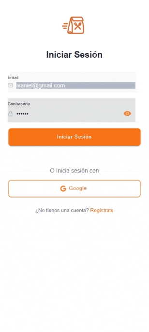

## Light

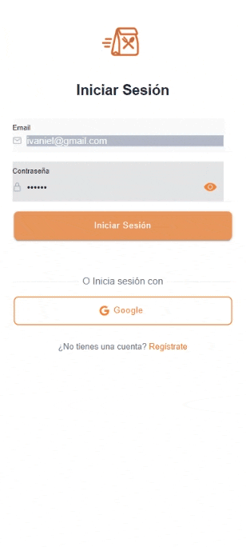

## Login

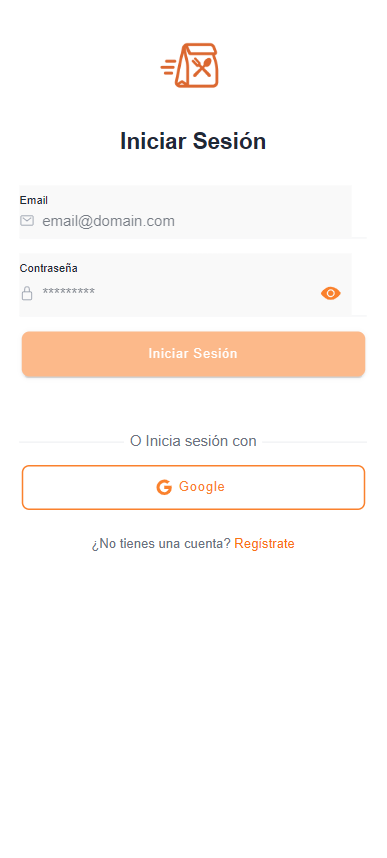

## Register

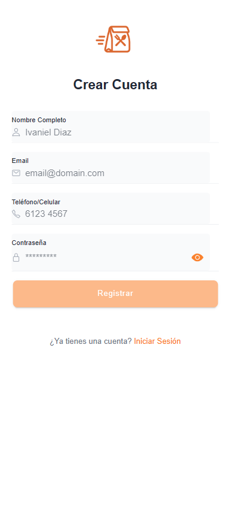

## Profile

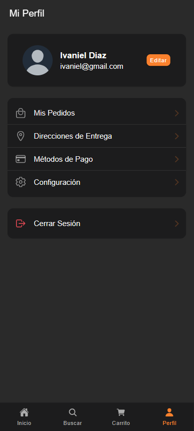

## User Update

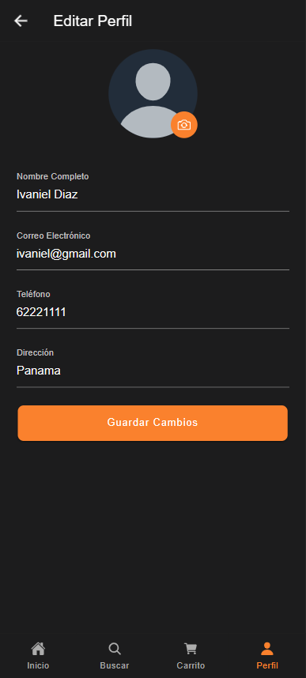

## Change Password

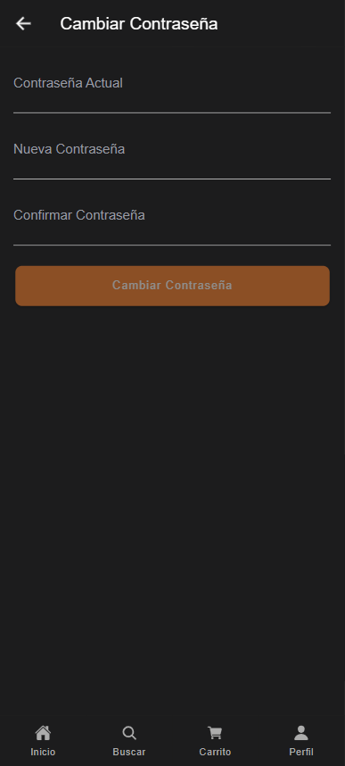

## Address

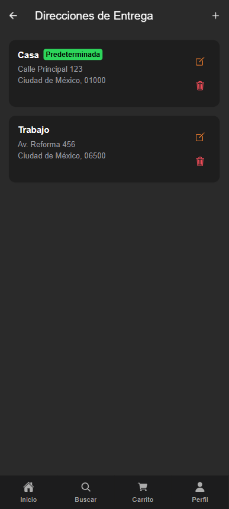

## Search


## Foods Details


## Food List

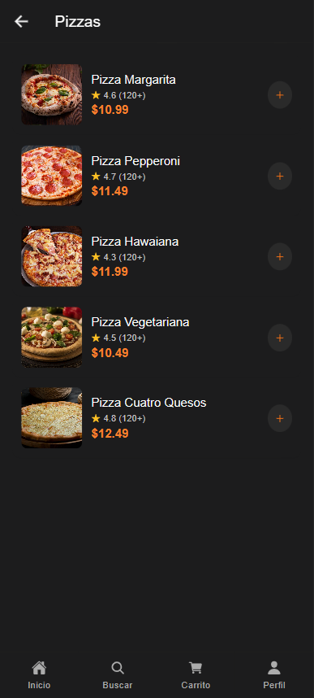

## Cart

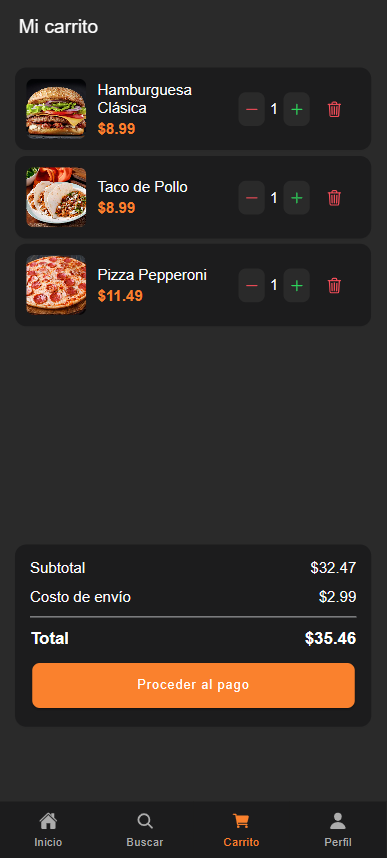

## Checkout

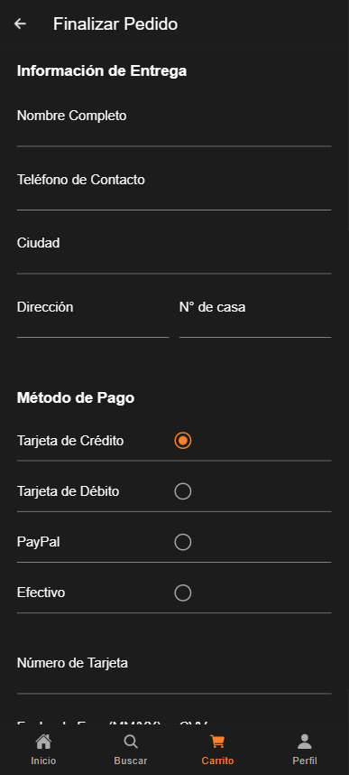

## Order History

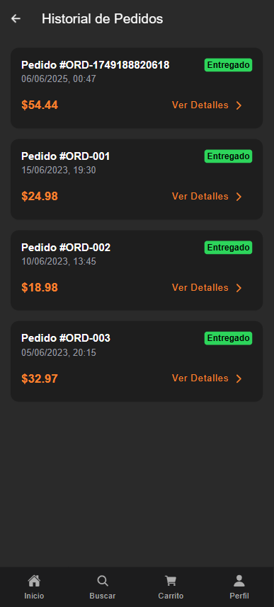

## Settings

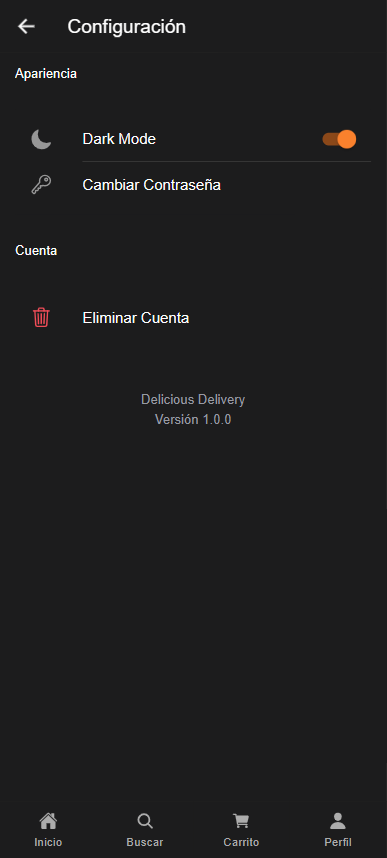